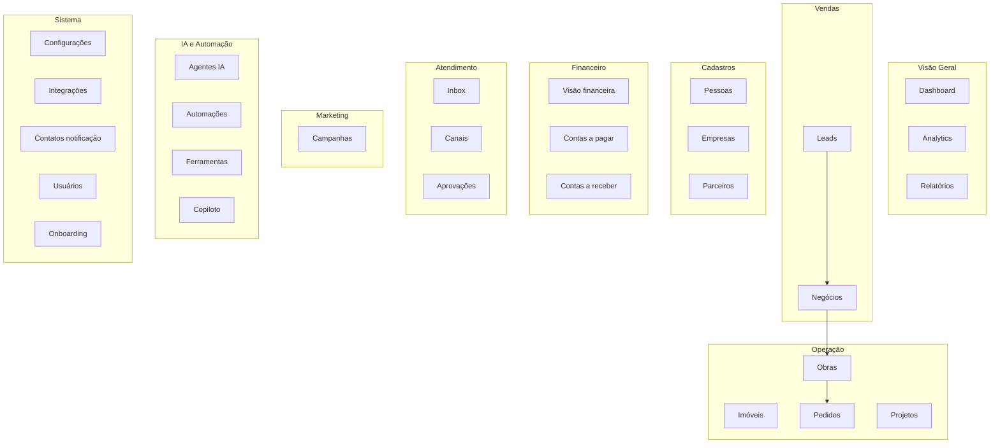

# Escritório Virtual Obra10+ — Guia para apresentação do produto

**Público:** apresentação comercial / demo interna  
**Última revisão:** 2026-05-22  
**Menu no código:** `lib/crm-nav-groups.ts` (11 gavetas · 28 itens)

---

## O que é o produto (elevator pitch)

O **Escritório Virtual** é o backoffice da Obra10+: um CRM + operação de obras + atendimento WhatsApp com **agentes de IA**, num único painel escuro (marca Obra10+). A equipa gere **leads, negócios, cadastros, obras, financeiro e automações** sem saltar entre ferramentas. O **Escritório** (`/office`) é a vista “sala virtual” dos agentes IA em tempo real; o **CRM** (`/crm`) é onde se trabalha o dia a dia.

**Entradas principais**

| Entrada | Rota | Função |
|---------|------|--------|
| Logo Obra10+ | `/crm` | Dashboard executivo |
| Escritório Virtual | `/office` | Mapa de agentes, decisões, feed ao vivo |
| Login | `/login` | Supabase Auth + perfil `public.users` (papéis owner, admin, …) |

---

## Mapa mental do menu

---

## 1. Visão Geral

### Dashboard (`/crm`)

**O que faz:** Painel executivo do dia — KPIs de pipeline, receita potencial, leads recentes, resumo da equipa IA, alertas operacionais, atalhos para Leads, Analytics e Parceiros.

**Para quem:** direção, gestão comercial, visão rápida ao abrir o sistema.

**Dados:** agrega métricas via API de dashboard (leads, negócios, agentes ativos, encaminhamentos).

---

### Analytics (`/crm/analytics`)

**O que faz:** Análise de desempenho por período (24h, 7d, 30d): funil, leads por dia, domínios (comercial, atendimento, parceiros, marketing, obras, IA). Permite recalcular KPIs.

**Para quem:** gestão que precisa de tendências, não só snapshot do dashboard.

**Nota:** `/crm/kpis` redireciona para aqui.

---

### Relatórios (`/crm/relatorios`)

**O que faz:** Exportação de dados (CSV) por entidade — leads, negócios, empresas, imóveis, financeiro, contas a pagar/receber, etc. Pré-visualização antes de descarregar.

**Para quem:** financeiro, BI leve, auditoria, partilha com Excel.

---

## 2. Vendas

### Leads (`/crm/leads`)

**O que faz:** Funil comercial em **kanban** — cada lead passa por estágios (triagem, qualificação, etc.). Lista conversas, valor estimado, origem (campanha, WhatsApp), responsável humano/IA. Ficha `/crm/leads/[id]` com detalhe, propostas e ação **Converter em negócio**.

**Para quem:** SDR, atendimento comercial, quem recebe contactos do WhatsApp ou campanhas.

**Fluxo típico:** mensagem WhatsApp → webhook → lead no kanban → qualificação → negócio.

---

### Negócios (`/crm/negocios`)

**O que faz:** Oportunidades fechadas em pipeline (kanban + lista). Valor, estágio, vínculo a pessoa/lead/imóvel. Ficha `/crm/negocios/[id]` para editar, arquivar e ligar a **projeto** ou **obra**.

**Para quem:** vendedores, gerentes comerciais.

**Fluxo típico:** lead qualificado → negócio → obra/projeto.

---

## 3. Cadastros

### Pessoas (`/crm/pessoas`)

**O que faz:** Base de **contactos** (PF/PJ): nome, telefone, e-mail, documento, morada, origem. Âncora para leads, negócios e atendimento. Criar, editar e arquivar; ficha `/crm/pessoas/[id]`.

**Para quem:** backoffice, atendimento, qualquer um que regista clientes.

---

### Empresas (`/crm/empresas`)

**O que faz:** Cadastro de **empresas** (razão social, CNPJ, segmento). Ligação a pessoas e negócios B2B. Ficha `/crm/empresas/[id]` com edição.

**Para quem:** vendas B2B, parcerias corporativas.

---

### Parceiros (`/crm/parceiros`)

**O que faz:** Rede de **parceiros** (arquitetos, engenheiros, fornecedores da rede Obra10+): homologação, capacidade, scores, encaminhamentos. Novo parceiro em `/crm/parceiros/novo`; portal do parceiro é rota à parte (`/parceiro`).

**Para quem:** gestão de rede, match lead ↔ parceiro certo.

---

## 4. Produtos

### Imóveis (`/crm/imoveis`)

**O que faz:** Catálogo de **imóveis/unidades** ligados ao negócio (mercado imobiliário e reforma). CRUD com fichas editáveis.

**Para quem:** equipa imobiliária, projetos ligados a imóvel.

---

## 5. Obras

### Obras (`/crm/obras`)

**O que faz:** Gestão de **obras em execução** — status, vínculo a negócio/projeto, painel por obra `/crm/obras/[id]`.

**Para quem:** operação, engenharia, pós-venda.

**Fluxo:** negócio ganho → abrir obra → pedidos de material.

---

### Pedidos (`/crm/pedidos`)

**O que faz:** **Pedidos de material/serviço** associados a obras (cotação, submissão para aprovação, respostas de fornecedor).

**Para quem:** obra, compras, fornecedor (`/fornecedor`).

---

## 6. Financeiro

### Visão financeira (`/crm/financeiro`)

**O que faz:** Dashboard financeiro — saldos, fluxo resumido, KPIs. Atalho para **+ Novo lançamento** e export.

**Para quem:** gestão, financeiro.

---

### Contas a pagar (`/crm/financeiro/pagar`)

**O que faz:** Lista e gestão de **despesas** a pagar (fornecedores, obras, operação).

---

### Contas a receber (`/crm/financeiro/receber`)

**O que faz:** Lista de **recebíveis** (clientes, parcelas de negócio).

---

## 7. Projetos

### Projetos (`/crm/projetos`)

**O que faz:** **Projetos** entre negócio e obra (planeamento, escopo). Liga negócio → projeto → obra → pedido.

**Para quem:** gestão de projeto, coordenação comercial-operacional.

---

## 8. Atendimento

### Inbox (`/crm/atendimento`)

**O que faz:** **Caixa de conversas** — fila de leads com WhatsApp (e metadados), histórico de mensagens, envio de resposta, contexto do lead (score, próxima ação). Centro do atendimento humano + IA.

**Para quem:** atendentes, supervisores de canal.

---

### Canais (`/crm/canais`)

**O que faz:** **Monitorização** das instâncias WhatsApp (UAZAPI): estado connected/disconnected, agente ligado, região — **sem** criar instância nem QR aqui (isso fica na ficha do **Agente IA**, passos cadastro + pareamento).

**Para quem:** TI, admin de canais, suporte.

---

### Aprovações (`/crm/aprovacoes`)

**O que faz:** Fila de **pedidos/decisões** que exigem humano (valores altos, cotações, regras de autonomia dos agentes).

**Para quem:** gerência, diretor, compliance.

---

## 9. Marketing

### Campanhas (`/crm/trafego`)

**O que faz:** Métricas de **tráfego pago** (integração Windsor quando configurada): campanhas Meta/Google, CPL, gasto. Empty state orienta a configurar chaves em Integrações.

**Para quem:** marketing, growth.

---

## 10. IA & Automação

### Agentes IA (`/crm/agentes` · `/crm/agentes/novo` · `/crm/agentes/[slug]`)

**O que faz:** Catálogo de **agentes virtuais** (SDR, atendente, diretor, etc.): cargo, personalidade, prompt, modelo Mistral/Claude, **WhatsApp UAZAPI** (passo 1 instância, passo 2 QR), RAG, playbook, ferramentas. Wizard **Novo agente** guia criação completa.

**Para quem:** admin de IA, operação de bots.

---

### Automações (`/crm/ciclos`)

**O que faz:** **Ciclos de execução** dos agentes (jobs periódicos, interação WhatsApp, agenda). Central de quando e como cada agente “acorda”.

**Para quem:** quem configura operação dos bots.

---

### Ferramentas (`/crm/ferramentas`)

**O que faz:** **Ferramentas** que os agentes podem invocar (custom tools, sync Mistral, matriz de autonomia).

**Para quem:** engenharia de prompts / integrações IA.

---

### Copiloto (`/crm/agentes-reais`)

**O que faz:** Placeholder **“Em breve”** — visão de copiloto interno unificado (humano + IA no mesmo fluxo).

**Para apresentação:** mencionar como roadmap, não como feature ativa.

---

## 11. Sistema

### Configurações (`/crm/configuracoes`)

**O que faz:** Parâmetros do **tenant**: follow-up, horário comercial, regras operacionais. Forms gravam em `hub_followup_config` / tenant settings.

**Para quem:** admin, owner.

---

### Integrações (`/crm/integracoes`)

**O que faz:** Estado das **ligações externas**: WhatsApp (UAZAPI), Windsor (tráfego), health Supabase/API. Cards “conectado / não configurado”.

**Para quem:** admin, DevOps leve.

---

### Contatos de notificação (`/crm/contatos`)

**O que faz:** Quem recebe **alertas** (e-mail/WhatsApp interno) de eventos do sistema.

---

### Usuários & Permissões (`/crm/usuarios`)

**O que faz:** Gestão da **equipa** — convite por e-mail, papéis (`owner`, `admin`, `vendedor`, `atendente`, `parceiro`). Só admin/owner.

**Para quem:** owner (ex.: Ramon com acesso total).

---

### Onboarding (`/crm/onboarding-tenant`) — só admin

**O que faz:** **Checklist de arranque** do tenant: migrações, env, primeiro canal WhatsApp, passos verdes/vermelhos.

**Para quem:** primeira implantação Obra10+.

---

## Fora do menu (mas existem)

| Rota | Função |
|------|--------|
| `/office` | Escritório virtual — mapa de agentes, decisões, mensagens ao vivo |
| `/crm/conteudo` | Conteúdo/marketing interno (oculto até estar pronto) |
| `/login` | Autenticação |
| `/fornecedor` | Portal do fornecedor (cotações) |
| `/parceiro` | Portal do parceiro |

---

## Fluxo de negócio em 30 segundos (para a apresentação)

1. **Campanha ou WhatsApp** gera **Lead** (kanban).  
2. Atendimento na **Inbox**; agente IA qualifica no canal.  
3. **Converter em Negócio** quando há oportunidade real.  
4. Cadastro em **Pessoa/Empresa**; opcional **Imóvel** e **Parceiro**.  
5. **Projeto** → **Obra** → **Pedidos** de material.  
6. **Aprovações** para decisões críticas.  
7. **Financeiro** regista pagar/receber.  
8. **Analytics / Relatórios** medem resultado.  
9. **Agentes + Automações** mantêm o canal 24/7.

---

## Papéis de utilizador (acesso)

| Papel | Acesso típico |
|-------|----------------|
| **owner** | Tudo, incluindo Usuários e Onboarding |
| **admin** | Quase tudo administrativo |
| **vendedor** | Vendas, cadastros, atendimento |
| **atendente** | Inbox, leads, canais |
| **parceiro** | Área restrita (portal parceiro) |

---

## Frases prontas para a demo

- *“O Dashboard é o cockpit; o resto são módulos especializados.”*  
- *“Leads é entrada; Negócios é oportunidade; Obras é execução.”*  
- *“A Inbox é onde o WhatsApp vira trabalho; Canais só mostra se o telefone está ligado.”*  
- *“Agentes IA são funcionários virtuais configuráveis — com QR separado do cadastro da instância.”*  
- *“O Escritório Virtual é a sala 3D dos agentes; o CRM é a mesa de trabalho.”*

---

## Maturidade honesta (se perguntarem)

| Área | Estado |
|------|--------|
| Vendas, cadastros, atendimento, agentes WhatsApp | Operacional |
| Obras, pedidos, projetos, financeiro | Implementado (S5/S6); validar dados reais no tenant |
| Campanhas (Windsor) | Depende de API key |
| Copiloto, Conteúdo | Roadmap |
| OAuth Meta/Google | Planeado |

---

*Documento derivado de `menu-lateral-crm-resumo.md`, `crm-sidebar-navigation.md`, `crm-fluxos.md` e código das páginas `/crm/*`.*
