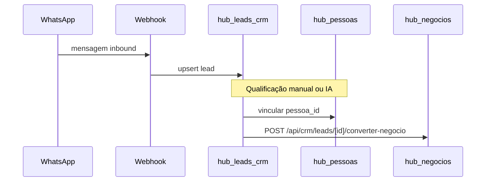

# CRM Obra10+ — fluxos de negócio

## Comercial (Fase A)

**Telas:** `/crm/leads` (kanban), `/crm/leads/[id]` (ficha + Criar negócio), `/crm/negocios` (kanban + lista), `/crm/negocios/[id]`.

**APIs:** `GET/PATCH /api/crm/leads/[id]`, `GET/PATCH /api/crm/negocios/[id]`, CRUD propostas em `/api/crm/leads/[id]/propostas`.

## Obra ponta a ponta (Fase B)

Imóvel (`hub_imoveis`) → Negócio → Obra (`hub_obras`) → Pedido material → Aprovação → Painel `/crm/obras/[id]`.

Menu: gaveta **Obras** em `lib/crm-nav-groups.ts` (Obras, Pedidos).

## KPIs, Analytics e relatórios

- Job: `POST /api/crm/kpis/calcular` (cron Vercel `:15` ou botão **Atualizar KPIs** em `/crm/analytics`).
- Painel: `GET /api/crm/analytics?periodo=24h|7d|30d` — funil, leads/dia, domínios comercial/atendimento/parceiros/marketing/obras/IA.
- Metas por agente: seed em `supabase/migrations/20260524120000_analytics_metas_seed.sql`.
- Export: `GET /api/crm/relatorios/export?entidade=leads|negocios|empresas|imoveis`.

## Multi-tenant (Fase E)

- Tenant legado: `00000000-0000-4000-8000-000000000001`.
- Header `x-tenant-id` + `INTERNAL_API_KEY` nas rotas server.
- RLS: `default_obra10_tenant_id()` para anon; JWT `tenant_id` para authenticated.
