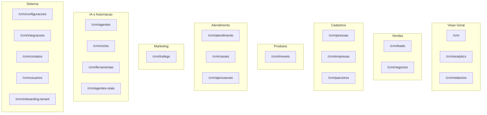

# Menu CRM — proposta consolidada (cruzamento)

**Data:** 2026-05-20  
**Fontes cruzadas:**

1. [`arquitetura-navegacao-crm.md`](arquitetura-navegacao-crm.md) — posicionamento *CRM Operacional com IA* (7 gavetas comerciais)
2. Análise de mercado (Pipedrive, HubSpot, Salesforce, RD, Agendor) — diagnóstico + reorganização + UX
3. [`inventario-menu-crm.md`](inventario-menu-crm.md) — estado atual no código

**Decisões já confirmadas pelo produto:**

- `/crm/analytics` com redirect de `/crm/kpis`
- `/crm/usuarios` no menu com placeholder até RBAC
- **Imóveis** na gaveta **Produtos** (Cadastros sem Imóveis)

---

## 1. O que as duas propostas concordam

| Tema | Consenso |
|------|----------|
| Separar vendas de cadastros mestres | Leads/Negócios ≠ Pessoas/Empresas/Imóveis |
| Relatórios fora de “mídia/parceiros” | Não ficar ao lado de Tráfego/Conteúdo |
| Canais WhatsApp | **Não** é IA → pertence ao atendimento |
| Integrações | Expor em Sistema |
| Renomear “Modelos” | → Agentes IA |
| Onboarding tenant | Não tratar como item de usuário final (admin) |
| Conteúdo “em breve” | Não degradar menu (esconder ou badge desabilitado) |
| Office vs CRM | Dois menus fragmentam — unificar modelo mental (médio prazo) |
| Diferencial do produto | IA + WhatsApp + operação, não “só CRM” |

---

## 2. Divergências e resolução recomendada

| Tópico | Proposta A (Operacional IA) | Proposta B (Mercado) | **Consolidado** | Motivo |
|--------|----------------------------|----------------------|-----------------|--------|
| Topo: métricas | Dashboard + Analytics + Relatórios (3 itens) | Dashboard com abas (1 item) | **Fase 1:** 3 itens (Analytics + redirect). **Fase 2:** abas no Dashboard | Entrega rápida agora; reduz competição no topo depois |
| Vendas vs cadastros | Uma gaveta “Comercial” (4 itens) | “Vendas” + “Cadastros” (2 gavetas) | **Vendas** + **Cadastros** | Alinhado a Pipedrive/HubSpot; vendedor não rola cadastro |
| Imóveis | Gaveta **Produtos** | Dentro de **Cadastros** | **Produtos** (1 item: Imóveis) | Vertical imobiliário; escala catálogo/portal sem misturar CRM |
| Parceiros | **Marketing** | **Cadastros** | **Cadastros** | Parceiro é rede/relacionamento, não campanha |
| Relatórios | **Visão Geral** | **Marketing** | **Visão Geral** | Export/CSV é analytics executivo, não mídia |
| Contatos (`/crm/contatos`) | **Operações** | **Sistema** (notificação) | **Sistema** — “Contatos de notificação” | Rota = `hub_contatos_notificacao`; não é inbox |
| Canais | IA & Automação | Atendimento | **Atendimento** | Onde a conversa acontece |
| Copiloto | Menu IA (5º item) | Não listado | **IA** com badge *Em breve* | Diferencial declarado; página ainda placeholder |
| Tarefas / Agenda | Não listado | Vendas | **Fase 3** — rotas novas; fora do menu até existir página | API/atividades parcial no backend |
| Conteúdo | No menu | Esconder até funcionar | **Fora do menu** (Fase 1) ou item desabilitado | Consenso anti “menu morto” |
| Operações vs Atendimento | Nome “Operações” + Inbox | “Atendimento” | Gaveta **Atendimento** (mercado) com item **Inbox** | Nome da gaveta familiar; item descreve inbox |

---

## 3. Estrutura alvo consolidada (7 gavetas · 19 itens no menu Fase 1)

Itens **em negrito** = mudança vs `NAV_GROUPS` atual.

```text
1. Visão Geral
   ├── Dashboard          /crm
   ├── Analytics          /crm/analytics   (redirect /crm/kpis)
   └── Relatórios         /crm/relatorios  (sai de Parceiros e mídia)

2. Vendas
   ├── Leads              /crm/leads
   └── Negócios           /crm/negocios
   [Fase 3: Tarefas /crm/tarefas, Agenda /crm/agenda — fora do menu até existir]

3. Cadastros
   ├── Pessoas            /crm/pessoas
   ├── Empresas           /crm/empresas
   ├── Imóveis            /crm/imoveis      → ver nota: pode ficar em "Produtos" se preferir só 1 ativo
   └── Parceiros          /crm/parceiros    (sai de Marketing)

4. Produtos                    ← opcional: fundir Imóveis aqui e tirar de Cadastros
   └── Imóveis            /crm/imoveis

5. Atendimento
   ├── Inbox              /crm/atendimento
   ├── Canais             /crm/canais       (sai de IA)
   └── Aprovações         /crm/aprovacoes

6. Marketing
   └── Campanhas          /crm/trafego
   [Conteúdo /crm/conteudo — oculto Fase 1]

7. IA & Automação
   ├── Agentes IA         /crm/agentes
   ├── Automações         /crm/ciclos
   ├── Ferramentas        /crm/ferramentas
   └── Copiloto           /crm/agentes-reais  (badge Em breve)

8. Sistema
   ├── Configurações      /crm/configuracoes
   ├── Integrações        /crm/integracoes
   ├── Contatos de notif. /crm/contatos
   ├── Usuários           /crm/usuarios      (placeholder)
   └── Onboarding         /crm/onboarding-tenant  (só admin / feature flag)
```

**Nota Imóveis vs Produtos:** para **8 gavetas** use Cadastros sem Imóveis + gaveta Produtos (proposta A). Para **7 gavetas** e menos cliques, Imóveis fica só em Cadastros (proposta B). **Recomendação Obra10:** manter gaveta **Produtos** — reforça vertical imobiliário e libera Cadastros para CRM puro.

**Contagem Fase 1 (com Produtos):** 7 gavetas, **20 itens** (sem Conteúdo, sem Tarefas/Agenda).

---

## 4. Matriz de implementação por fase

### Fase 1 — Quick wins (1 sprint) — consenso das duas fontes

| Ação | Origem |
|------|--------|
| Reorganizar `NAV_GROUPS` conforme secção 3 | A + B |
| `/crm/analytics` + redirect `/crm/kpis` | A (confirmado) |
| Mover Canais → Atendimento | B |
| Mover Parceiros → Cadastros; Relatórios → Visão Geral | A + B |
| Esconder Conteúdo do menu | B |
| Expor Integrações; Contatos em Sistema | A + B |
| Renomear Modelos → Agentes IA | B |
| Onboarding só admin (role/flag) | B |
| `/crm/usuarios` placeholder | A (confirmado) |
| Copiloto no menu com badge | A |

### Fase 2 — UX estrutural (1–2 sprints)

| Ação | Origem |
|------|--------|
| Dashboard com abas (Visão / Analytics / Atividade) | B |
| Dividir ex-“Comercial” em Vendas + Cadastros (+ Produtos) | A + B |
| Badges: Aprovações pendentes, Inbox não lidas | B |
| Botão **+ Novo** (Lead, Negócio, …) | B |
| Busca global Cmd+K | B |

### Fase 3 — Novos módulos

| Ação | Origem |
|------|--------|
| `/crm/tarefas`, `/crm/agenda` | B |
| Inbox de notificações do sistema (se ≠ contatos notif.) | B |
| Copiloto funcional | A |
| Conteúdo quando houver fluxo | B |
| Unificar `/office` com sidebar CRM | B |

---

## 5. Diagrama consolidado



---

## 6. Itens do diagnóstico B — status na proposta consolidada

| # | Diagnóstico | Resolvido na consolidada? |
|---|-------------|---------------------------|
| 1 | Pipeline mistura vendas e cadastros | Sim — Vendas + Cadastros (+ Produtos) |
| 2 | Parceiros e mídia incoerente | Sim — quebra em Cadastros + Marketing + Visão Geral |
| 3 | Canais na IA | Sim — Atendimento |
| 4 | Faltam Tarefas, Agenda, Notificações | Parcial — Fase 3; contatos notif. em Sistema |
| 5 | Conteúdo em breve no menu | Sim — ocultar Fase 1 |
| 6 | Dashboard + KPIs separados | Parcial — Analytics rota; abas Fase 2 |
| 7 | Integrações escondidas | Sim — Sistema |
| 8 | Nome Modelos | Sim — Agentes IA |
| 9 | Onboarding no menu final | Sim — admin only |
| 10 | CRM vs Office | Planeado Fase 3 |

---

## 7. Próximo passo

Implementar **Fase 1** do plano `migração_menu_crm` usando **esta** árvore (secção 3), não a árvore literal da proposta A nem da B isoladas.

Quando autorizar: *“implementa Fase 1 do menu consolidado”*.
