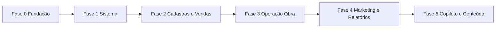

# Plano — configurar telas do CRM (menu lateral)

**Objetivo:** levar cada item do menu ([`menu-lateral-crm-resumo.md`](menu-lateral-crm-resumo.md)) de *parcial/placeholder* para **utilizável no dia a dia**, com dados reais, CRUD onde fizer sentido e integrações configuráveis.

**Estado atual (2026-05):** ~15 rotas **prontas**, ~11 **parciais**, 2 **placeholder** (Copiloto, Usuários). Nenhuma rota do menu sem página.

**Pré-requisitos globais:** ver [`crm-operacional-checklist.md`](crm-operacional-checklist.md) (Supabase, tenant, env, migrações).

---

## Critério de “tela configurada”

Para cada rota do menu, considerar **feita** quando:

1. **Dados** — lê/escreve tabelas `hub_*` (ou API dedicada) com `tenant_id` correto.
2. **Ações** — criar, editar e (se aplicável) arquivar/excluir sem ir ao Supabase manual.
3. **Estados vazios** — mensagem clara + CTA (não tela em branco nem erro técnico).
4. **Integrações** — se depende de env (Windsor, UAZAPI…), UI mostra *conectado / não configurado* com link para Integrações.
5. **Mobile** — fluxo principal usável na barra inferior (`lib/mobile/nav.ts`) onde a rota estiver exposta.

---

## Visão por fases

| Fase | Foco | Duração indicativa | Desbloqueia |
|------|------|-------------------|-------------|
| **0** | Fundação tenant + RBAC mínimo | 3–5 dias | Usuários, permissões, onboarding |
| **1** | Sistema (config + integrações) | 5–8 dias | Campanhas, automações estáveis |
| **2** | Cadastros + Vendas (edição) | 5–7 dias | Funil comercial completo |
| **3** | Obras → Projetos → Pedidos | 8–12 dias | Cadeia operacional |
| **4** | Relatórios + Marketing | 4–6 dias | BI e tráfego |
| **5** | Copiloto + Conteúdo (opcional) | 10+ dias | Diferencial IA unificado |

*Estimativas para 1 dev familiar com o repo; paralelizar F2 e partes de F1 se duas pessoas.*

---

## Fase 0 — Fundação (antes de telas “bonitas”)

### 0.1 Usuários & Permissões (`/crm/usuarios`)

| Entrega | Detalhe |
|---------|---------|
| Listagem | `users` + `app_role` (owner, admin, vendedor, …) |
| Convite | E-mail ou link + registro Supabase Auth |
| Edição de papel | PATCH com guarda admin-only |
| RLS | Políticas alinhadas a `tenant_id` (revisar migrações) |

**Aceite:** admin convida utilizador; novo user vê só dados do tenant.

### 0.2 Onboarding tenant (`/crm/onboarding-tenant`)

| Entrega | Detalhe |
|---------|---------|
| Wizard | Passos: tenant OK → migrações → env críticos → primeiro canal WhatsApp |
| Persistência | `hub_tenant_onboarding` ou flags em `hub_tenants` |
| Checklist vivo | Verde/vermelho com links (não texto estático) |

**Aceite:** owner conclui onboarding e dashboard deixa de mostrar alertas de setup.

**Dependências:** Fase 0 bloqueia confiança em multiusuário; pode começar em paralelo com 0.1.

---

## Fase 1 — Sistema configurável

### 1.1 Configurações (`/crm/configuracoes`)

| Bloco | Persistir em | UI |
|-------|--------------|-----|
| SLA / follow-up | `hub_followup_config` (ou equivalente) | Form + preview |
| Horário comercial | tenant settings | Timezone + janela |
| Comissões / regras | JSON em tenant ou tabela dedicada | Campos numéricos + help |
| Health | manter `/api/health` | Cards com status real |

**Aceite:** alterar SLA reflete no próximo follow-up automático (ou documentar “só manual” até cron existir).

### 1.2 Integrações (`/crm/integracoes`)

| Integração | Estado na UI | Implementação mínima |
|------------|--------------|----------------------|
| WhatsApp (UAZAPI) | Conectado / erro / não configurado | Reutilizar lógica de `/crm/canais` |
| Windsor (tráfego) | Chave presente | Teste `GET` leve à API |
| Meta / Google / GA4 | Em breve ou OAuth fase 2 | Card + doc link; não mentir “conectado” |
| Supabase / Anthropic | Só health (admin) | Já em health |

**Aceite:** `/crm/trafego` mostra empty state com botão “Configurar em Integrações” se `WINDSOR_API_KEY` ausente.

### 1.3 Itens já prontos (manutenção)

- **Contatos de notificação** — regressão apenas.
- **Financeiro** — manter; opcional: categorias, anexos (fora deste plano base).

---

## Fase 2 — Cadastros e Vendas (edição completa)

### 2.1 Pessoas e Empresas

| Rota | Adicionar |
|------|-----------|
| `/crm/pessoas/[id]` | Form edição (nome, contactos, tags); PATCH API |
| `/crm/empresas/[id]` | Form edição (razão social, CNPJ, segmento); manter toggle acesso |
| Listas | Botão editar na linha ou drawer reutilizável |

**Aceite:** corrigir telefone na ficha sem SQL.

### 2.2 Imóveis (`/crm/imoveis`)

| Adicionar |
|-----------|
| Editar imóvel (drawer igual ao criar) |
| Arquivar / status (ativo, vendido, off) |
| Opcional: galeria / URL portal |

### 2.3 Negócios (`/crm/negocios`)

| Adicionar |
|-----------|
| Editar título, valor, empresa/pessoa vinculada no detalhe |
| Excluir ou arquivar com confirmação |
| Alinhar detalhe com kanban (uma fonte de verdade) |

### 2.4 Leads (refino)

| Adicionar |
|-----------|
| Consolidar `/crm/lead/[id]` legado → redirect para `/crm/leads` |
| Propostas/negócio: validar fluxo “Criar negócio” na ficha |

**Itens já prontos:** Leads lista/kanban, Parceiros.

---

## Fase 3 — Operação (Obra → Projeto → Pedido)

### 3.1 Obras (`/crm/obras`, `/crm/obras/[id]`)

| Entrega |
|---------|
| Form criar/editar obra (cliente, endereço, status, datas) |
| Painel `[id]`: abas Pedidos, Diário, Check-ins (dados já existentes) |
| Link para negócio/projeto |

### 3.2 Pedidos (`/crm/pedidos`)

| Entrega |
|---------|
| Criar pedido de material (obra, itens, status) |
| Editar status (rascunho → enviado → recebido) |
| Remover mensagem “criar só no painel da obra” |

### 3.3 Projetos (`/crm/projetos`)

| Entrega |
|---------|
| CRUD projeto (nome, negócio_id, obra_id opcional) |
| Lista filtrada por negócio/obra |
| KPI simples no card (pedidos abertos, valor) |

**Aceite:** fluxo **Negócio fechado → Projeto → Obra → Pedido** navegável por links na UI.

**Dependências:** schema em [`crm-modelo-dados.md`](crm-modelo-dados.md); validar FKs nas migrações.

---

## Fase 4 — Visão executiva e Marketing

### 4.1 Relatórios (`/crm/relatorios`)

| Entrega |
|---------|
| Manter export CSV (leads, negócios, financeiro…) |
| Adicionar: filtro período + entidade + preview tabela |
| Opcional: agendar export (cron) — fase 4b |

### 4.2 Campanhas (`/crm/trafego`)

| Entrega |
|---------|
| Empty state sem Windsor |
| Dashboard Windsor quando chave OK (já parcial) |
| Link bidirecional com Integrações |

### 4.3 Dashboard / Analytics (refino)

| Entrega |
|---------|
| Cards alinhados a módulos configurados (esconder pipeline obra se vazio) |
| Documentar métricas vs [`crm-fluxos.md`](crm-fluxos.md) |

---

## Fase 5 — Diferencial (opcional / posterior)

### 5.1 Copiloto (`/crm/agentes-reais`)

- Remover badge “Em breve” só quando houver orquestração (múltiplos agentes, contexto CRM).
- Até lá: manter redirect educativo para `/crm/agentes` ou ocultar do menu.

### 5.2 Conteúdo (`/crm/conteudo`)

- Entrar no menu com badge ou gaveta Marketing quando CRUD `hub_conteudo` existir.

### 5.3 Financeiro avançado (fora do menu atual)

- DRE, NFe, conciliação bancária — plano separado após Fase 3 estável.

---

## Matriz resumo (menu → fase)

| Gaveta | Item | Fase | Status alvo |
|--------|------|------|-------------|
| Visão Geral | Dashboard | — | Manter |
| Visão Geral | Analytics | — | Manter |
| Visão Geral | Relatórios | 4 | Parcial → Pronto |
| Vendas | Leads | 2 | Refino |
| Vendas | Negócios | 2 | Parcial → Pronto |
| Cadastros | Pessoas, Empresas | 2 | Parcial → Pronto |
| Cadastros | Parceiros | — | Manter |
| Produtos | Imóveis | 2 | Parcial → Pronto |
| Obras | Obras, Pedidos | 3 | Parcial → Pronto |
| Financeiro | *todos* | — | Manter |
| Projetos | Projetos | 3 | Parcial → Pronto |
| Atendimento | *todos* | — | Manter |
| Marketing | Campanhas | 1+4 | Parcial → Pronto |
| IA | Agentes, Ciclos, Ferramentas | — | Manter |
| IA | Copiloto | 5 | Placeholder |
| Sistema | Configurações | 1 | Parcial → Pronto |
| Sistema | Integrações | 1 | Parcial → Pronto |
| Sistema | Contatos | — | Manter |
| Sistema | Usuários | 0 | Placeholder → Pronto |
| Sistema | Onboarding | 0 | Parcial → Pronto |

---

## Ordem de execução recomendada (sprints)

| Sprint | Escopo | Entregável visível |
|--------|--------|-------------------|
| **S1** | Fase 0.1 + 0.2 | Usuários + onboarding vivo |
| **S2** | Fase 1.1 + 1.2 | Configurações + Integrações com estado real |
| **S3** | Fase 2 (cadastros) | Fichas pessoas/empresas/imóveis editáveis |
| **S4** | Fase 2 (negócios) + leads cleanup | Negócio editável; menos rotas legado |
| **S5** | Fase 3.1–3.2 | Obra + pedidos CRUD |
| **S6** | Fase 3.3 + 4 | Projetos + relatórios + tráfego empty state |
| **S7+** | Fase 5 | Copiloto / conteúdo conforme produto |

---

## Riscos e decisões de produto

| Tema | Decisão sugerida |
|------|------------------|
| Copiloto no menu | Manter com badge até Fase 5; evita expectativa falsa |
| `/crm/conteudo` | Fora do menu até S7 |
| RBAC fino | Começar com 3–4 papéis; permissões por módulo depois |
| Integrações OAuth | Meta/Google em sub-fase 1b se Windsor + UAZAPI bastarem no curto prazo |
| Mobile | Cada sprint: validar rota na barra `Mais` / gaveta correspondente |

---

## Como acompanhar

1. Atualizar coluna **Status** neste doc ou em [`menu-lateral-crm-resumo.md`](menu-lateral-crm-resumo.md) (secção “Estado das telas” — a criar).
2. PRs pequenos por rota (ex.: `feat(crm): usuarios convite`).
3. Checklist de regressão: [`crm-operacional-checklist.md`](crm-operacional-checklist.md) após cada sprint.

---

## Referências

- Menu: [`menu-lateral-crm-resumo.md`](menu-lateral-crm-resumo.md)
- Navegação: [`crm-sidebar-navigation.md`](crm-sidebar-navigation.md)
- Dados: [`crm-modelo-dados.md`](crm-modelo-dados.md), [`crm-fluxos.md`](crm-fluxos.md)
- Produto menu: [`menu-navegacao-consolidado.md`](menu-navegacao-consolidado.md)
