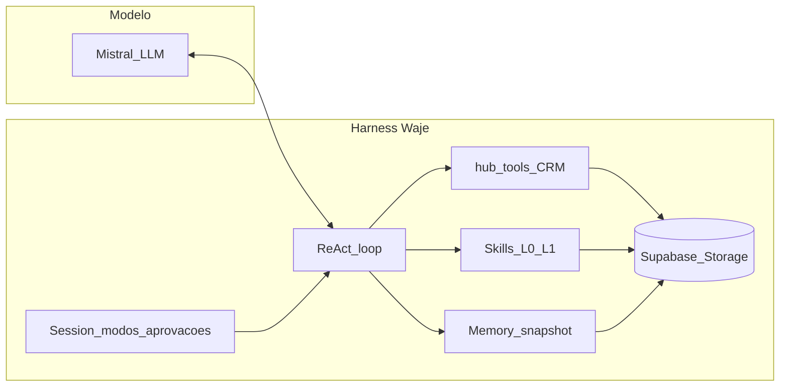

# RFC: Harness interno Waje v0.1

**Status:** Proposta (roadmap)  
**Data:** 2026-06-25  
**Âmbito:** Agentes internos (`modo_operacao = jobs_internos`) — copiloto CRM, ciclos IA, WhatsApp gestor  
**Fora de âmbito:** Engine de canal comercial (WhatsApp/e-mail ao cliente final)

---

## 1. Resumo executivo

Este RFC define a evolução do “harness” dos superagentes internos Waje, combinando o melhor de três referências:

| Referência | O que adoptamos | O que **não** copiamos |
|------------|-----------------|------------------------|
| **OpenClaw** | Separar **host CRM** (canal, tenant, auditoria, política) de **runtime do turno** (loop modelo + tools) com contrato estável | Runtimes plugin Codex/CLI; TUI terminal |
| **Hermes** | **Skills** como documentos vivos (`SKILL.md`), memória curada, progressive disclosure, loop de melhoria pós-turno | Filesystem global `~/.hermes`; terminal/sandbox local |
| **Mastra** | **Sessão de produto**: modos, aprovações de tools, estado para UI, persistência | AgentController genérico fora do domínio CRM |

**Estado actual:** harness = `system_prompt_base` + array `SuperagenteSkill` (metadata) gerados no wizard; runtime = `executarAgenteInterno` monolítico com Mistral function calling.

**Estado alvo:** harness Waje em três camadas — `HarnessHost` → `HarnessSession` → `HarnessRuntime` — com skills executáveis, memória por agente/tenant e UX de copiloto com aprovações formais.

---

## 2. Visão de produto (stakeholders)

### O que é um hiperagente empresarial Waje

Um **hiperagente empresarial** (também designado **superagente interno** no produto) é um assistente de IA que **opera a empresa de verdade** — CRM, relatórios, ciclos programados e canal do gestor — com dados do tenant, ferramentas reais e **competências que evoluem com o uso**, não um chatbot que só responde texto.

Características que o distinguem de um “agente configurado”:

- **Opera** — consulta e altera `hub_*` com paridade à interface web (com aprovação humana para escrita).
- **Lembra** — memória curada por agente e tenant (preferências da equipa, convenções CRM).
- **Aprende** — skills em `SKILL.md` que o próprio agente pode criar ou melhorar após tarefas complexas.
- **Governa** — modos de trabalho (conversar, analisar, operar, planear) e confirmação antes de side effects.
- **Persiste** — ciclos às 8h, WhatsApp do gestor e copiloto CRM partilham o mesmo runtime e o mesmo conhecimento acumulado.

**Fora de âmbito desta visão:** atendimento ao cliente final no WhatsApp/e-mail comercial — continua na engine de canal existente, separada do harness.

### Nomenclatura sugerida (produto)

| Termo actual (código / UI) | Com harness (recomendado) | Notas para copy e documentação |
|----------------------------|---------------------------|--------------------------------|
| Agente interno / superagente | **Hiperagente empresarial** | Termo de marketing e onboarding; pode manter “superagente interno” em labels técnicos |
| `jobs_internos` (`modo_operacao`) | Hiperagente (modo empresa) | Sem mudança de enum na BD na v0.1 |
| Harness (wizard: prompt + skills metadata) | **Runtime Waje** + skills + memória | “Harness” no código (`lib/harness/`); na UI preferir “motor do agente” ou “runtime” |
| Copiloto / painel briefing | **Surface principal** do hiperagente | Outras surfaces: ciclo programado, WhatsApp gestor |
| `SuperagenteSkill` (bullets no prompt) | **Skill** (`SKILL.md` / `hub_agente_skills`) | Runbook executável com progressive disclosure |
| `hub_memorias_agente` / Mem0 | **Memória do hiperagente** | Built-in curada + Mem0 como provider externo |
| `executarAgenteInterno` | `HarnessHost.run()` → `HarnessRuntime.runTurn()` | Migração interna; nome público não exposto |
| Wizard “gerar harness” | **Configurar hiperagente** (ferramentas → skills → prompt) | Ordem invertida: tools primeiro, skills depois |

### Jornada resumida (gestor)

1. **Criar** — escolhe cargo, activa toolsets (CRM, relatórios, multimodal), revisa skills geradas.
2. **Conversar** — copiloto em modo *analisar* ou *conversar*; dados sempre via tool call.
3. **Operar** — modo *operar*; alterações CRM com card de aprovação.
4. **Automatizar** — ciclos e WhatsApp gestor usam o mesmo hiperagente.
5. **Evoluir** — após semanas de uso, skills e memória reduzem tempo e erros no mesmo tipo de pedido.

### O que “hiper” significa (e o que não significa)

| Significa | Não significa |
|-----------|-----------------|
| Mais capaz **dentro do CRM e da operação do tenant** | AGI genérico, terminal, sandbox no servidor do cliente |
| Melhora **com conversas e ciclos** (skills + memória) | Modelo LLM diferente ou “mais inteligente” por magia |
| **Governação** (modos, aprovações, auditoria `hub_acoes_ia`) | Autonomia total sem supervisão humana |
| **Multi-surface** (copiloto + cron + gestor) | Um único chat isolado |

---

## 3. Problema

1. **Poder limitado:** skills são bullets no prompt, não runbooks que o agente carrega sob demanda nem melhora com o uso.
2. **Runtime acoplado:** `executarAgenteInterno` mistura montagem de prompt, loop LLM, execução de tools, memória e resposta ao canal.
3. **UX de copiloto incompleta:** confirmação de gravação CRM depende do modelo obedecer ao prompt; não há suspensão formal do loop à espera de OK humano.
4. **Sem evolução:** o agente não cria nem patcha skills após resolver tarefas difíceis (diferencial Hermes).
5. **Risco de regressão:** agentes de canal (`canal_whatsapp`, `canal_email`) não podem ser afectados por mudanças no harness interno.

---

## 4. Objectivos

### 4.1 Objectivos (MUST)

- [x] Contrato estável `HarnessRuntime.runTurn()` desacoplado do host CRM.
- [x] `HarnessSession` persistida por conversa (copiloto) com estado para UI.
- [x] Skills em formato **agentskills.io** com progressive disclosure (L0/L1/L2).
- [x] Memória curada por `agente_slug` + `tenant_id` com snapshot congelado por sessão.
- [x] Aprovação formal antes de tools de **escrita** CRM (`hub_int_crm_ent_*` create/update).
- [x] Manter paridade CRM: tabelas `hub_*` via `hub_int_crm_ent_*` (Fix-1/2 já entregues).
- [x] Zero alteração na engine de atendimento ao cliente (`lib/ia/engine.ts`, webhooks).

### 4.2 Não-objectivos (v0.1)

- Terminal/sandbox (Docker, SSH) — irrelevante para CRM multi-tenant SaaS.
- Subagentes paralelos (`delegate_task`) — fase posterior.
- Runtime plugável estilo Codex/OpenClaw — só contrato interno Waje na v0.1.
- Skills comunitárias públicas (Hub Hermes) — apenas tenant-scoped.

---

## 5. Arquitectura alvo

```
┌──────────────────────────────────────────────────────────────────┐
│  SURFACES (entrada)                                               │
│  copiloto_crm │ ciclo_programado │ whatsapp_gestor │ API (futuro) │
└────────────────────────────┬─────────────────────────────────────┘
                             │
┌────────────────────────────▼─────────────────────────────────────┐
│  HarnessHost (OpenClaw — “host”)                                  │
│  • tenant_id, agente_slug, usuario_crm_id                          │
│  • política de tools (uso_ferramentas_ia + toolsets)               │
│  • auditoria hub_acoes_ia, RLS via service_role + filtros         │
│  • entrega: texto, urls_publicas, notificações gestor              │
└────────────────────────────┬─────────────────────────────────────┘
                             │
┌────────────────────────────▼─────────────────────────────────────┐
│  HarnessSession (Mastra — “sessão de produto”)                    │
│  • thread_id, modo activo, grants, pending_approvals               │
│  • displayState (reducer de eventos para CopilotoMultimodal)       │
│  • follow-up queue, token_usage                                    │
└────────────────────────────┬─────────────────────────────────────┘
                             │
┌────────────────────────────▼─────────────────────────────────────┐
│  HarnessRuntime (OpenClaw — “runtime do turno”)                   │
│  runTurn(input) → loop Mistral → hooks → resultado terminal      │
│  • compaction / truncagem de histórico                             │
│  • classificação de outcome (texto, tool-only, erro)             │
└──────────┬─────────────────────────────┬───────────────────────────┘
           │                             │
┌──────────▼──────────┐         ┌────────▼──────────┐
│  SkillsStore        │         │  MemoryStore       │
│  (Hermes)           │         │  (Hermes)          │
│  hub_agente_skills  │         │  hub_agente_memory │
│  progressive load   │         │  frozen snapshot   │
└─────────────────────┘         └────────────────────┘
```

### 5.1 Responsabilidades (fronteira host vs runtime)

Inspirado em [OpenClaw Agent harness plugins](https://docs2.openclaw.ai/plugins/sdk-agent-harness):

| Responsabilidade | HarnessHost (Waje) | HarnessRuntime |
|------------------|-------------------|----------------|
| Canal / surface | ✅ | ❌ |
| `tenant_id` em toda query | ✅ | recebe no contexto |
| Registo e política de tools | ✅ define surface | executa dispatch |
| Aprovações humanas | ✅ UI + persistência | suspende loop |
| Loop modelo + tool calls | delega | ✅ |
| Compaction de contexto | política | ✅ implementação |
| Skills / memória load | ✅ stores | consome snapshot |
| Auditoria `hub_acoes_ia` | ✅ após tool | emite eventos |

### 5.2 Anatomia do harness (Agent = Model + Harness)

Referência de engenharia: [The Anatomy of an Agent Harness](https://medium.com/design-bootcamp/the-anatomy-of-an-agent-harness) (Kushal Banda, 2026) — equação **Agente = Modelo (inteligência) + Harness (maquinaria)**. O modelo só faz texto-in → texto-out; o harness torna essa inteligência **útil para trabalho real**. No Waje, o **modelo** é Mistral (ou outro via `hub_modelos`); **todo o resto** do hiperagente empresarial é harness.

| Componente (literatura) | O que faz | Equivalente Waje | Fase RFC |
|-------------------------|-----------|------------------|----------|
| **ReAct loop** | Thought → Action → Observation → repeat | `HarnessRuntime.runTurn()` + `completarChatComFerramentasMistral` + `executarFerramentaHub` | 1 |
| **System prompt + hooks** | Comportamento determinístico, middleware | `build-system-prompt.ts`, `tool-policy.ts`, modos sessão | 1–2 |
| **Tools / MCP** | Acções fora do modelo | `hub_int_crm_ent_*`, integradores, Mem0; MCP Zapier opcional | 0 ✅ |
| **Filesystem** | Estado persistente, artefactos, multi-agente | **Supabase + Storage** — `hub_*`, artefactos canvas, `hub_tenant_conhecimento_*`; *não* bash local | 0 ✅ |
| **Bash / sandbox** | Computador genérico do agente | **Fora de âmbito** v0.1 — CRM SaaS usa tools tipadas, não shell | — |
| **Skills (progressive disclosure)** | Evitar context rot no arranque; load JIT | `hub_agente_skills` L0/L1/L2, `harness_skill_view` | 3 |
| **Memória / AGENTS.md** | Aprendizado entre sessões sem retreino | `hub_agente_memory` + `hub_memorias_agente` + Mem0; frozen snapshot | 4 |
| **Compaction** | Resumir/offload quando contexto cresce | Truncagem hoje; **compaction** em `HarnessRuntime` (Fase 5) | 5 |
| **Tool output offloading** | Head/tail in-context, corpo em disco | Respostas CRM JSON truncadas no histórico; artefactos em URL pública, não no prompt | 1, 5 |
| **Web / dados actuais** | Pós-cutoff | `hub_int_crm_ent_*`, views `vw_rel_*`, RAG conhecimento tenant | 0 ✅ |
| **Orchestration / Ralph loop** | Tarefas longas, contexto limpo por iteração | **Ciclos programados** + Fase 5 `harness_delegate_task`; verificação = `ok:true` CRM + smoke | 5 |
| **Self-verification** | Testar output, corrigir | Regra runtime: só afirmar factos com tool JSON; re-consultar após gravar | 0 ✅ |
| **Aprovações (governação)** | Bash é arriscado → human-in-the-loop | Modo `operar` + `pending_approvals` (substituto enterprise do sandbox) | 2 |

**Context rot** (Chroma 2025): degradação de qualidade mesmo abaixo do limite da janela. O RFC mitiga com: snapshot congelado de memória/skills, skills L0 only no prompt, compaction (Fase 5), e não rebuil do system prompt mid-turn.

**Insight meta:** o mesmo modelo com harness diferente pode variar 20–30% em benchmarks — no Waje, investir em **tool-policy, skills e sessão** pesa tanto quanto trocar de modelo Mistral.



**Equação Waje:**

> **Hiperagente empresarial** = **Modelo** + **HarnessHost** + **HarnessSession** + **HarnessRuntime** + **Stores** (skills, memória, conhecimento tenant em Postgres/Storage)

---

## 6. Contratos TypeScript (v0.1)

Ficheiro proposto: `lib/harness/types.ts` (ainda não implementado).

```ts
/** Surface de entrada — alinha com SuperagenteCanalInterno existente */
export type HarnessSurface =
  | "copiloto_crm"
  | "ciclo_programado"
  | "whatsapp_gestor";

/** Modos de trabalho do copiloto (Mastra-inspired) */
export type HarnessModeId =
  | "conversar"   // default — Q&A, explicações
  | "analisar"    // consultas CRM, relatórios, sem escrita
  | "operar"      // CRUD com aprovação
  | "planear";    // gera plano markdown, não executa

export type HarnessTurnInput = {
  sessionId: string;
  surface: HarnessSurface;
  modeId: HarnessModeId;
  mensagemUsuario: string;
  historico: Array<{ role: "user" | "assistant"; content: string }>;
  anexos?: Array<{ tipo: string; conteudo_base64?: string; url?: string }>;
};

export type HarnessTurnResult = {
  texto: string;
  modelo: string;
  tokens_input: number;
  tokens_output: number;
  custo_brl?: number;
  urls_publicas?: string[];
  /** Tool calls que ficaram pendentes de aprovação humana */
  pending_approvals?: HarnessPendingApproval[];
  /** Eventos para o reducer de UI */
  events?: HarnessEvent[];
};

export type HarnessPendingApproval = {
  id: string;
  tool_name: string;
  arguments: Record<string, unknown>;
  resumo_humano: string;
  nivel: "escrita_crm" | "integracao" | "artefato";
};

export type HarnessEvent =
  | { type: "message_delta"; delta: string }
  | { type: "tool_start"; name: string }
  | { type: "tool_end"; name: string; ok: boolean }
  | { type: "approval_required"; approval: HarnessPendingApproval }
  | { type: "mode_changed"; modeId: HarnessModeId };
```

**Runtime interface:**

```ts
export interface HarnessRuntime {
  readonly id: "waje-mistral-v1";

  runTurn(
    ctx: HarnessHostContext,
    session: HarnessSessionSnapshot,
    input: HarnessTurnInput
  ): Promise<HarnessTurnResult>;

  /** Opcional: continuar turno após aprovação */
  resumeAfterApproval?(
    ctx: HarnessHostContext,
    session: HarnessSessionSnapshot,
    approvalId: string,
    decisao: "aprovar" | "rejeitar"
  ): Promise<HarnessTurnResult>;
}
```

**Migração:** `executarAgenteInterno` torna-se adaptador fino que chama `HarnessHost.run()` até remoção completa.

---

## 7. Skills (Hermes + agentskills.io)

### 7.1 Formato

Cada skill = registo em `hub_agente_skills` + corpo `SKILL.md`:

```markdown
---
name: listar-leads-crm
description: Listar e filtrar leads na tabela hub_leads_crm do tenant
version: 1.0.0
metadata:
  waje:
    toolsets: [crm_operacoes]
    requires_tools: [hub_int_crm_ent_lead]
    agente_slug: lucca
    tenant_id: "*"
---

# Listar leads CRM

## Quando usar
Pedidos de listagem, contagem ou pesquisa por nome/telefone/e-mail.

## Procedimento
1. Chamar `hub_int_crm_ent_lead` com `acao=consultar`.
2. Usar `filtro_texto` se o utilizador indicou critério.
3. Responder apenas com dados do JSON (`fonte: tabela_crm`).

## Verificação
- `ok: true` e `total` coerente com `registos.length`.
```

### 7.2 Progressive disclosure

| Nível | Mecanismo | Custo tokens |
|-------|-----------|--------------|
| **L0** | Índice no system prompt: `{ id, description }` | ~50–100 tokens/skill |
| **L1** | Tool `harness_skill_view(skill_id)` | sob demanda |
| **L2** | `harness_skill_view(skill_id, path)` para anexos | sob demanda |

Tools novas (fase 3):

- `harness_skills_list`
- `harness_skill_view`
- `harness_skill_manage` (create / patch / delete — com `write_approval`)

### 7.3 Origem das skills

1. **Bundled:** geradas no wizard a partir do cargo (`gerar-harness-interno.ts` → seed em `hub_agente_skills`).
2. **Agent-created:** após tarefa complexa, loop de melhoria propõe patch (Hermes `skill_manage`).
3. **Admin:** gestor edita no CRM (futuro UI “Skills do agente”).

### 7.4 Wizard invertido (decisão de produto)

Ordem no wizard de agente interno:

1. **Ferramentas** — activar toolsets (`crm_operacoes`, `relatorios`, `multimodal`, integradores).
2. **Gerar skills** — Mistral/determinístico cria `SKILL.md` por toolset activo (não o contrário).
3. **Prompt base** — cargo + skills L0 + limites legais.
4. **Revisão** — gestor aprova skills antes de publicar agente.

---

## 8. Memória (Hermes)

### 8.1 Stores por agente + tenant

| Campo | Limite sugerido | Conteúdo |
|-------|-----------------|----------|
| `memory_operacional` | 2 200 chars | Factos CRM, convenções do tenant, lições aprendidas |
| `memory_utilizador` | 1 375 chars | Preferências do gestor que fala com o copiloto |

Tabela proposta: `hub_agente_memory` (`tenant_id`, `agente_slug`, `target`, `conteudo`, `atualizado_em`).

### 8.2 Frozen snapshot

- No **início da sessão**, host injecta snapshot no system prompt (não muta mid-turn).
- Tool `harness_memory` (add/replace/remove) persiste em DB; efeito no prompt = **próxima sessão**.
- **Mem0** continua como provider externo (já usado em `memoria-superagente.ts`); built-in memory não substitui Mem0 — complementa.

### 8.3 Loop de melhoria pós-turno (fase 4)

Após `runTurn` bem-sucedido, job assíncrono (modelo barato):

1. Releitura digest da conversa (últimos N turnos).
2. Proposta: patch memória e/ou skill.
3. Se `memory.write_approval` / `skills.write_approval` → staging em `hub_harness_pending_writes`.
4. Gestor aprova no copiloto (`/memoria pending` estilo Hermes — UI Waje equivalente).

---

## 9. Sessão e UI (Mastra)

### 9.1 Tabela `hub_harness_sessions`

| Coluna | Tipo | Notas |
|--------|------|-------|
| `id` | uuid | PK |
| `tenant_id` | uuid | RLS |
| `agente_slug` | text | |
| `surface` | text | copiloto_crm, … |
| `modo_id` | text | conversar, analisar, operar, planear |
| `thread_id` | uuid | FK mensagens briefing |
| `resource_id` | text | `usuario_crm_id` ou telefone gestor |
| `state` | jsonb | preferências UI, flags |
| `grants` | jsonb | ex.: `{ "crm_escrita_sessao": true }` |
| `pending_approvals` | jsonb | fila de aprovações |
| `token_usage` | jsonb | acumulado |
| `harness_version` | text | ex. `0.1.0` |
| `criado_em` / `atualizado_em` | timestamptz | |

### 9.2 Modos

| Modo | Tools de escrita | UX |
|------|------------------|-----|
| `conversar` | bloqueadas | explicação, sem side effects |
| `analisar` | bloqueadas | só consultar + artefactos leitura |
| `operar` | com aprovação | card “Confirmar alteração no CRM” |
| `planear` | bloqueadas | output `.md` em storage temporário |

Selector no `AgenteBriefingChatPanel` (chips ou dropdown).

### 9.3 Aprovações

Fluxo:

1. Runtime detecta tool de escrita (`hub_int_crm_ent_*` com `criar`/`atualizar`).
2. Emite `approval_required`; **não** executa tool.
3. UI mostra diff humano (resumo + campos).
4. Utilizador: Aprovar sessão / Aprovar uma vez / Rejeitar.
5. `resumeAfterApproval` continua o loop com resultado da tool.

Inspirado em Mastra `tool_approval_required` + Hermes approval scopes.

### 9.4 displayState

Reducer no cliente (`useHarnessDisplayState`) consumindo `HarnessEvent[]`:

- `isStreaming`, `activeTools`, `pendingApproval`, `modeId`, `tokenUsage`.

Permite evoluir o copiloto sem reescrever `AgenteBriefingChatPanel` a cada feature.

---

## 10. Toolsets

Agrupamento lógico (Hermes toolsets) mapeado para `uso_ferramentas_ia`:

| Toolset | Tools incluídas | Surfaces default |
|---------|-----------------|------------------|
| `crm_operacoes` | `hub_int_crm_ent_*`, `hub_int_crm_atualizar_lead` | todas |
| `crm_relatorios` | `hub_int_crm_consultar`, `hub_superagente_dados` | copiloto, ciclo |
| `artefatos` | `hub_superagente_artefato`, `hub_relatorio_html_simples` | todas |
| `multimodal` | `hub_mistral_percepcao` | copiloto |
| `metricas` | `hub_metricas_escritorio` | ciclo |
| `memoria` | Mem0 keys, `harness_memory` | todas |
| `skills` | `harness_skills_*`, `harness_skill_manage` | interno only |

Tools de toolset desactivado **ausentes** do schema Mistral (economia de tokens + segurança).

---

## 11. Roadmap de implementação

### Fase 0 — Baseline ✅ (concluída)

- [x] Fix-1: `consultar` em tabelas `hub_*`
- [x] Fix-2: prompts alinhados (`executar-agente-interno`, copiloto)
- [x] Smoke `scripts/smoke-consultar-lead-tabela.mjs`
- [x] Copiloto multimodal

**Critério de saída:** Lucca lista leads via tabela com `tenant_id` correcto.

---

### Fase 1 — Contrato Runtime (OpenClaw) — ~1 sprint ✅ (2026-06-25)

**Entregáveis:**

- [x] `lib/harness/types.ts` — contratos acima
- [x] `lib/harness/runtime/waje-mistral-v1.ts` — extrair loop de `executarAgenteInterno`
- [x] `lib/harness/host.ts` — montagem de contexto, política tools, auditoria
- [x] `executarAgenteInterno` → delega para `HarnessHost.run()`
- [x] Testes unitários: `lib/harness/harness.test.ts` (classificação de outcome, URLs, feature-flag, metadata)

**Critério de saída:** comportamento idêntico ao actual em copiloto + ciclos; diff de código isolado em `lib/harness/`.

---

### Fase 2 — Sessão + modos + aprovações (Mastra) — ~1–2 sprints ✅

**Entregáveis:**

- [x] Migração SQL `hub_harness_sessions`
- [x] API `POST /api/hub/agentes/[slug]/harness/session`
- [x] API `POST .../harness/approve`
- [x] Modos no `AgenteBriefingChatPanel`
- [x] Suspensão de loop em writes CRM
- [x] `displayState` / reducer de eventos no copiloto

**Critério de saída:** alterar lead exige clique de aprovação no copiloto; modo `analisar` não grava mesmo se o modelo tentar.

---

### Fase 3 — Skills vivas (Hermes) — ~2 sprints ✅

**Entregáveis:**

- [x] Migração SQL `hub_agente_skills`
- [x] Tools `harness_skills_list`, `harness_skill_view`, `harness_skill_manage`
- [x] Wizard: ferramentas → gerar skills → prompt
- [x] Progressive disclosure L0 no system prompt
- [x] Seed skills a partir de `skills-from-cargo.ts`
- [x] Painel gestor: lista skills + métricas (`AgenteHarnessSkillsBlock`)

**Critério de saída:** agente carrega skill `listar-leads-crm` sob demanda; gestor vê lista de skills no painel do agente.

---

### Fase 4 — Memória + loop de melhoria (Hermes) — ~1–2 sprints ✅

**Entregáveis:**

- [x] `hub_agente_memory` + tool `harness_memory`
- [x] Frozen snapshot por sessão (`session.state.memory_snapshot`)
- [x] Job pós-turno `harness-background-review` (cron ou queue)
- [x] UI pending writes (memória/skills/CRM)
- [x] Config `write_approval` por tenant (`hub_tenants.settings.harness`)

**Critério de saída:** após 5 conversas sobre preferências, memória reflecte na sessão seguinte; patches auto ficam em staging se approval on.

---

### Fase 5 — Polish e poder “nível Hermes” — contínuo ✅ (v0.3.0)

- [x] Subagentes para relatórios longos (`harness_delegate_to_agent`)
- [x] FTS de sessões passadas (`harness_session_search` + migração FTS)
- [x] Compaction inteligente de histórico
- [x] Métricas: custo por sessão, taxa de aprovação, skills criadas (`/harness/metrics`)
- [x] Documentação operacional + runbook (este RFC)

**Critério de saída:** agente interno cria skill reutilizável após workflow complexo; equipa mede adopção no dashboard.

---

## 12. Compatibilidade e migração

### 12.1 Agentes existentes

- `system_prompt_base` mantém-se; adicionar `harness_version: "0.1.0"` em `hub_agente_identidade` (coluna nova opcional).
- Regenerar harness via `/api/hub/agentes/gerar-harness-interno` popula `hub_agente_skills` sem apagar prompt legado.
- Feature flag `HARNESS_V1_ENABLED` (env) por tenant para rollout gradual.

### 12.2 Agentes de canal

- `agenteEhModoCanal()` continua a usar `engine.ts` / `agente-briefing-chat` ramo simulação/briefing antigo.
- Nenhum import de `lib/harness/` na engine WhatsApp.

### 12.3 Ficheiros afectados (mapa)

| Actual | Evolução |
|--------|----------|
| `lib/hub/executar-agente-interno.ts` | adaptador → `lib/harness/host.ts` |
| `lib/hub/superagente/gerar-harness-interno.ts` | gera skills DB + prompt |
| `lib/hub/superagente/skills-from-cargo.ts` | seed determinístico → `hub_agente_skills` |
| `lib/hub/superagente/memoria-superagente.ts` | integra `MemoryStore` |
| `components/crm/AgenteBriefingChatPanel.tsx` | modos + aprovações + displayState |
| `app/api/hub/agentes/[slug]/briefing-chat/route.ts` | delega HarnessHost |

---

## 13. Riscos e mitigações

| Risco | Mitigação |
|-------|-----------|
| Regressão WhatsApp | feature flag; testes de não-regressão `verify-regression-plan.mjs` |
| Vazamento cross-tenant | `tenant_id` obrigatório em todas as queries harness; smoke por tenant |
| Custo LLM (prompt mutável) | frozen snapshot memória/skills; L0 only no prompt |
| Modelo ignora aprovações | runtime **não** dispatch write sem grant; modo `analisar` hard block |
| Prompt antigo contradiz runtime | `harness_version` + aviso no wizard “regenerar harness” |
| Complexidade | fases independentes; Fase 1 sem mudança de UX |

---

## 14. Métricas de sucesso

| Métrica | Baseline | Alvo v1 |
|---------|----------|---------|
| Tool call antes de afirmar factos CRM | parcial | >95% em eval interna |
| Writes CRM sem aprovação humana (modo operar) | possível | 0% |
| Skills activas por agente interno | 3–6 metadata | 5–15 documentos |
| Skills criadas pelo agente (30 dias) | 0 | >1 por agente activo |
| Tempo médio copiloto (p95) | medir | não regredir >10% |

---

## 15. Referências

- OpenClaw — [Agent runtime architecture](https://docs.openclaw.ai/agent-runtime-architecture)
- OpenClaw — [Agent harness plugins](https://docs2.openclaw.ai/plugins/sdk-agent-harness)
- Hermes — [Skills](https://hermes-agent.nousresearch.com/docs/user-guide/features/skills)
- Hermes — [Memory](https://hermes-agent.nousresearch.com/docs/user-guide/features/memory)
- Mastra — [Harness overview](https://mastra.ai/docs/harness/overview)
- agentskills.io — formato `SKILL.md` (compatível Hermes)
- Waje — `lib/hub/executar-agente-interno.ts`, `lib/hub/superagente/types.ts`
- Kushal Banda — [The Anatomy of an Agent Harness](https://medium.com/design-bootcamp/the-anatomy-of-an-agent-harness) (Agent = Model + Harness; ReAct, skills, compaction, memory)

---

## 16. Próximo passo imediato

**v0.2 implementada** — migração `20260801100000_hub_harness_platform.sql`:

- `hub_harness_sessions`, `hub_agente_skills`, `hub_agente_memory`
- `hub_harness_delegations`, `hub_harness_pending_writes`
- Tools: `harness_skills_list`, `harness_skill_view`, `harness_delegate_to_agent`, `harness_transfer_lead`
- Motor interno (`lib/harness`) + externo (`engine.ts`) + webhook handoff

**Em seguida:** UI modos/aprovações no copiloto; seed skills no wizard; dashboard delegações.

---

*Documento vivo — actualizar `harness_version` e checkboxes à medida que as fases forem concluídas.*
